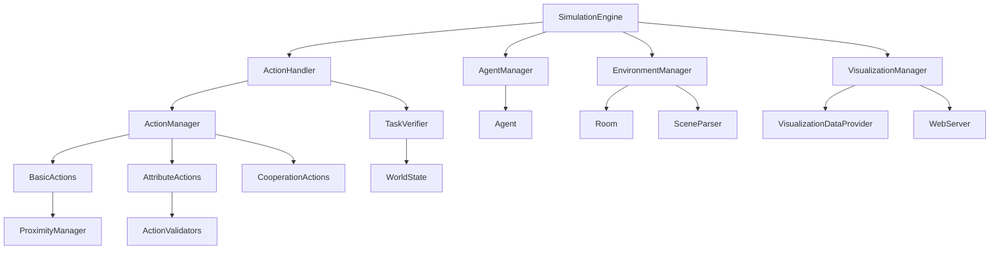

# 系统架构文档

本文档详细描述了Embodied Simulator的系统架构、设计原则和核心组件。

## 目录
- [架构概览](#架构概览)
- [核心组件](#核心组件)
- [数据流](#数据流)
- [设计原则](#设计原则)
- [扩展机制](#扩展机制)

## 架构概览

### 整体架构

```
┌─────────────────────────────────────────────────────────────┐
│                    Embodied Simulator                      │
├─────────────────────────────────────────────────────────────┤
│  🎮 User Interface Layer                                   │
│  ├── Interactive Executor                                  │
│  ├── Web Visualization                                     │
│  └── Test Scripts                                          │
├─────────────────────────────────────────────────────────────┤
│  🔧 API Layer                                              │
│  ├── SimulationEngine (Main Entry)                        │
│  ├── ActionHandler (Command Processing)                   │
│  └── DataLoader (Data Access)                             │
├─────────────────────────────────────────────────────────────┤
│  🏗️ Core Layer                                             │
│  ├── WorldState (State Management)                        │
│  ├── ActionManager (Action Coordination)                  │
│  ├── AgentManager (Agent Management)                      │
│  └── EnvironmentManager (Scene Management)                │
├─────────────────────────────────────────────────────────────┤
│  ⚡ Action System                                          │
│  ├── BasicActions (GOTO, GRAB, PLACE)                     │
│  ├── AttributeActions (OPEN, CLEAN, TURN_ON)              │
│  └── CooperationActions (CORP_GRAB, CORP_GOTO)            │
├─────────────────────────────────────────────────────────────┤
│  🛠️ Utility Layer                                          │
│  ├── TaskVerifier (Task Validation)                       │
│  ├── ProximityManager (Spatial Relations)                 │
│  ├── ActionValidators (Precondition Checks)               │
│  └── Feedback System (User Feedback)                      │
├─────────────────────────────────────────────────────────────┤
│  🎨 Visualization Layer                                    │
│  ├── VisualizationManager (Coordination)                  │
│  ├── VisualizationDataProvider (Data Processing)          │
│  └── WebServer (HTTP Interface)                           │
├─────────────────────────────────────────────────────────────┤
│  📊 Data Layer                                             │
│  ├── Scene Data (JSON)                                    │
│  ├── Task Data (JSON)                                     │
│  ├── Verification Data (JSON)                             │
│  └── Configuration (YAML)                                 │
└─────────────────────────────────────────────────────────────┘
```

### 模块依赖关系



## 核心组件

### 1. SimulationEngine (核心引擎)

**职责**: 系统的主要入口点，协调所有子系统

**关键特性**:
- 统一的初始化接口
- 配置管理
- 组件生命周期管理
- 错误处理和恢复

**接口设计**:
```python
class SimulationEngine:
    def __init__(self, config=None, task_abilities=None)
    def initialize_with_data(self, data: Dict) -> bool
    def get_visualization_url(self) -> str
    def stop_visualization(self)
```

### 2. ActionHandler (动作处理器)

**职责**: 处理智能体命令，集成任务验证

**关键特性**:
- 命令解析和路由
- 任务验证集成
- 错误处理和反馈
- 动作注册管理

**处理流程**:
```
Command Input → Parse → Validate → Execute → Verify → Return Result
```

### 3. WorldState (世界状态)

**职责**: 维护全局状态，提供状态查询接口

**状态管理**:
- 智能体状态 (位置、库存、能力)
- 物体状态 (位置、属性、关系)
- 房间状态 (包含物体、连接关系)
- 任务状态 (完成情况、进度)

**设计模式**: 单例模式，确保状态一致性

### 4. ActionManager (动作管理器)

**职责**: 动作的注册、分发和执行协调

**动作分类**:
- **基础动作**: 不需要特殊能力的通用动作
- **属性动作**: 基于物体属性的动作，支持工具需求
- **合作动作**: 需要多智能体协作的动作

**注册机制**:
- 全局注册: 系统启动时注册基础动作
- 动态注册: 根据任务能力动态注册特定动作

### 5. VisualizationManager (可视化管理器)

**职责**: 管理Web可视化系统

**组件结构**:
- **DataProvider**: 数据处理和格式化
- **WebServer**: HTTP服务器和REST API
- **Frontend**: HTML/CSS/JavaScript界面

**更新机制**: 轮询模式，前端定期请求最新数据

## 数据流

### 1. 命令执行流程

```
User Input → ActionHandler → ActionManager → Specific Action → WorldState Update → Task Verification → Result Return
```

**详细步骤**:
1. 用户输入命令字符串
2. ActionHandler解析命令
3. ActionManager路由到具体动作
4. 动作执行前置验证
5. 更新WorldState
6. 触发任务验证 (如果启用)
7. 返回执行结果

### 2. 可视化数据流程

```
WorldState → VisualizationDataProvider → JSON Format → WebServer → Frontend Display
```

**数据转换**:
1. 从WorldState提取原始数据
2. 格式化为可视化友好的JSON
3. 通过REST API提供给前端
4. 前端渲染为交互式界面

### 3. 任务验证流程

```
Action Execution → TaskVerifier → Verification Rules → Completion Status → Feedback
```

**验证模式**:
- **step_by_step**: 每步执行后验证
- **global**: 仅在done命令时验证
- **disabled**: 禁用验证

## 设计原则

### 1. 模块化设计

**原则**: 每个模块职责单一，接口清晰
**实现**: 
- 清晰的模块边界
- 最小化模块间依赖
- 标准化的接口设计

### 2. 可扩展性

**原则**: 支持功能扩展而不修改核心代码
**实现**:
- 插件式动作系统
- 配置驱动的行为
- 事件驱动的架构

### 3. 数据驱动

**原则**: 行为由数据配置决定，而非硬编码
**实现**:
- JSON格式的场景和任务定义
- CSV配置的属性动作
- YAML配置的系统参数

### 4. 错误容忍

**原则**: 优雅处理错误，提供有用的反馈
**实现**:
- 分层错误处理
- 详细的错误消息
- 状态恢复机制

### 5. 性能优化

**原则**: 在保证功能的前提下优化性能
**实现**:
- 按需加载组件
- 缓存机制
- 异步处理

## 扩展机制

### 1. 动作扩展

**添加新动作类型**:
```python
class NewAction(BaseAction):
    def execute(self, agent, target_id=None, **kwargs):
        # 实现动作逻辑
        return ActionStatus.SUCCESS, "成功", {}

# 注册动作
action_manager.register_action_class("new_action", NewAction)
```

### 2. 验证扩展

**自定义验证规则**:
```python
class CustomVerifier:
    def verify_custom_condition(self, world_state):
        # 实现验证逻辑
        return True, "验证通过"
```

### 3. 可视化扩展

**添加新的数据类型**:
```python
def get_custom_visualization_data(world_state):
    return {
        'custom_objects': [...],
        'custom_relationships': [...]
    }
```

### 4. 配置扩展

**添加新配置项**:
```yaml
# 在simulator_config.yaml中添加
custom_feature:
  enabled: true
  parameters:
    param1: value1
    param2: value2
```

## 性能考虑

### 1. 内存管理

- **对象池**: 重用频繁创建的对象
- **弱引用**: 避免循环引用导致的内存泄漏
- **延迟加载**: 按需加载大型数据结构

### 2. 计算优化

- **缓存机制**: 缓存计算结果避免重复计算
- **批量处理**: 批量执行相似操作
- **算法优化**: 使用高效的数据结构和算法

### 3. I/O优化

- **异步I/O**: 非阻塞的文件和网络操作
- **数据压缩**: 压缩传输的数据
- **连接池**: 重用网络连接

## 安全考虑

### 1. 输入验证

- **命令验证**: 验证用户输入的命令格式
- **参数检查**: 检查参数的有效性和安全性
- **权限控制**: 限制危险操作的执行

### 2. 资源保护

- **内存限制**: 防止内存耗尽
- **CPU限制**: 防止CPU过度使用
- **文件访问**: 限制文件系统访问范围

### 3. 网络安全

- **端口绑定**: 仅绑定本地端口
- **访问控制**: 限制Web界面的访问
- **数据加密**: 敏感数据的加密传输

## 未来发展

### 1. 分布式支持

- **多节点部署**: 支持分布式智能体
- **负载均衡**: 智能分配计算任务
- **故障恢复**: 节点故障的自动恢复

### 2. 实时性能

- **事件驱动**: 基于事件的实时响应
- **流式处理**: 实时数据流处理
- **低延迟**: 优化响应时间

### 3. AI集成

- **智能规划**: AI驱动的任务规划
- **自适应学习**: 从执行中学习优化
- **自然语言**: 自然语言命令接口
