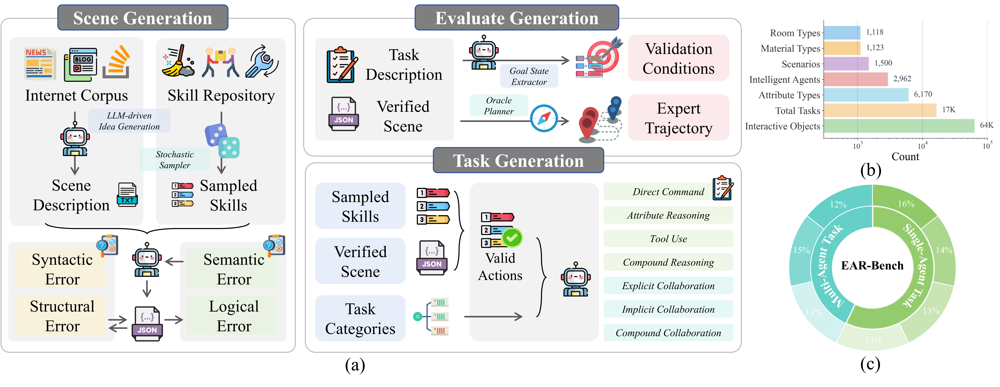
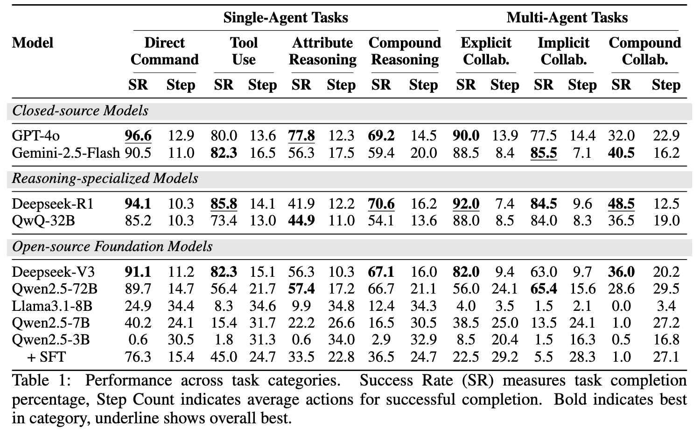
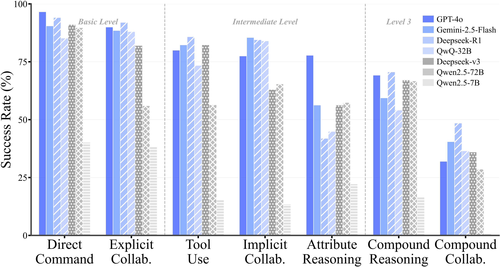
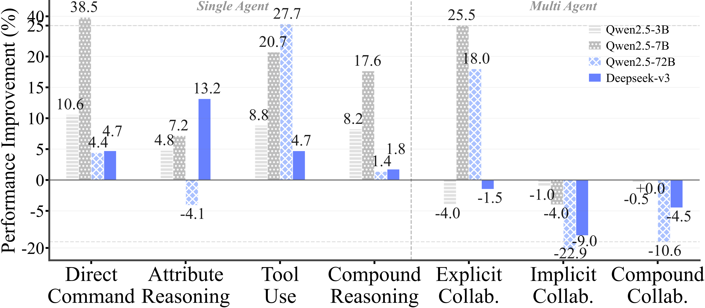
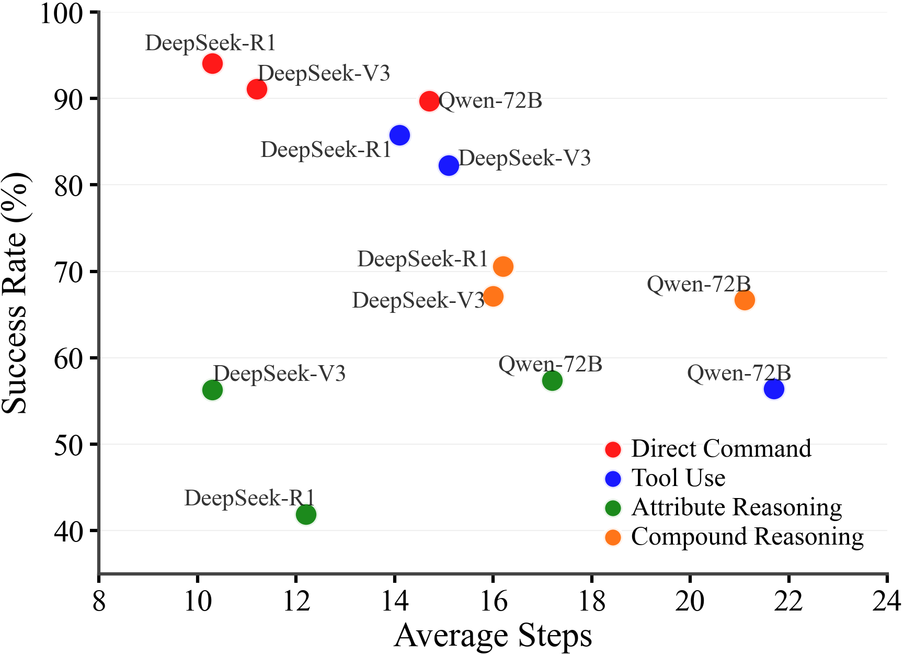
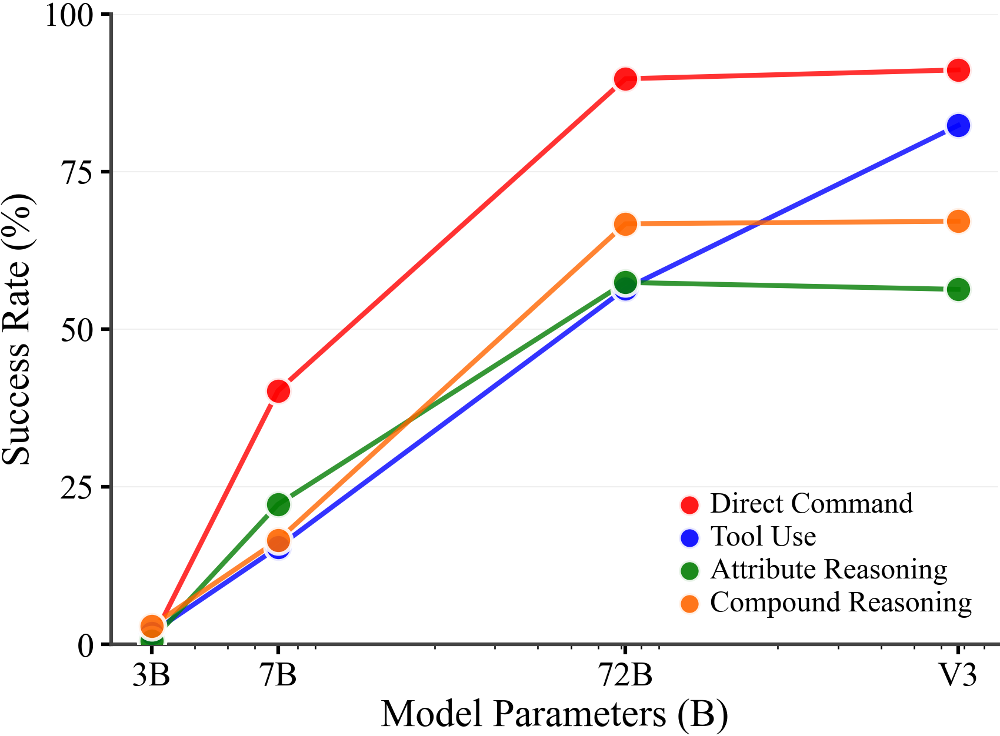

<div align="center">
     <h1> OmniEAR </h1> 
     

<h3><a href="https://arxiv.org/abs/2508.05614">Benchmarking Agent Reasoning in Embodied Tasks</a></h3>

[Zixuan Wang]()<sup>1</sup>, &nbsp; [Dingming Li]()<sup>1</sup>, &nbsp; [Hongxing Li]()<sup>1</sup>, &nbsp; [Shuo Chen]()<sup>1</sup>, &nbsp; [Yuchen Yan]()<sup>1</sup>, &nbsp; [Wenqi Zhang]()<sup>1</sup>, <br> [Yongliang Shen]()<sup>1</sup>, &nbsp; [Weiming Lu]()<sup>1</sup>, &nbsp;  [Jun Xiao]()<sup>1</sup>, &nbsp;  [Yueting Zhuang]()<sup>1</sup>

<sup>1</sup>[Zhejiang University, China](https://www.zju.edu.cn/english/)

<br>


[](https://arxiv.org/abs/2508.05614)
[](https://www.python.org/downloads/)
[](https://opensource.org/licenses/MIT)
[](https://github.com/ZJU-REAL/OmniEmbodied)

<br>

</div>

**🔗 Quick Links:**
- **[🌐 Project Homepage](https://zju-real.github.io/OmniEmbodied/)** - Interactive demos, detailed analysis, and visual results
- **[📄 arXiv Paper](https://arxiv.org/abs/2508.05614)** - Complete research paper with methodology and results
- **[📖 Documentation](https://omniembodied.readthedocs.io/en/latest/)** - Installation guides, API reference, and tutorials
- **[📊 Dataset](data/)** - EAR-Bench evaluation dataset with 1,500 scenarios
- **[🤗 Expert Trajectories](https://huggingface.co/datasets/wangzx1210/OmniEAR)** - SFT expert trajectories for model fine-tuning (1,982 samples)


## Abstract

Large language models excel at abstract reasoning but their capacity for embodied agent reasoning remains largely unexplored. We present **OmniEAR**, a comprehensive framework for evaluating how language models reason about physical interactions, tool usage, and multi-agent coordination in embodied tasks. Unlike existing benchmarks that provide predefined tool sets or explicit collaboration directives, OmniEAR requires agents to dynamically acquire capabilities and autonomously determine coordination strategies based on task demands. Through text-based environment representation, we model continuous physical properties and complex spatial relationships across **1,500 scenarios** spanning household and industrial domains.

Our systematic evaluation reveals severe performance degradation when models must reason from constraints: while achieving **85-96% success** with explicit instructions, performance drops to **56-85%** for tool reasoning and **63-85%** for implicit collaboration, with compound tasks showing **over 50% failure rates**. Surprisingly, complete environmental information degrades coordination performance, indicating models cannot filter task-relevant constraints. Fine-tuning improves single-agent tasks dramatically (0.6% to 76.3%) but yields minimal multi-agent gains (1.5% to 5.5%), exposing fundamental architectural limitations.

<p align="center">
  
</p>

*Figure 1: Overview of the OmniEAR framework comprising three integrated components: **OmniSimulator** (left) uses structured text representation to model environments with objects, agents, and spatial relationships; **EAR-Bench** (right) presents our comprehensive evaluation matrix spanning single-agent and multi-agent tasks.*

## 🎯 Key Contributions

1. **Novel Evaluation Framework**: We introduce OmniEAR, the first framework to evaluate embodied reasoning through scenarios requiring agents to understand how physical properties determine actions, capabilities, and coordination needs.

2. **Comprehensive Benchmark**: EAR-Bench provides 1,500 scenarios with continuous physical properties and dynamic capabilities, supported by OmniSimulator and an automated generation pipeline.

3. **Fundamental Insights**: We provide empirical evidence that current language models lack core embodied reasoning capabilities, with performance degrading over 60% when moving from explicit instructions to embodied reasoning.


## 📊 Benchmark Statistics

<p align="center">
  
</p>

*Figure 2: OmniEAR automated benchmark generation and evaluation framework showing the four-stage pipeline and comprehensive statistics.*


### Task Categories

**Single-Agent Tasks:**
- **Direct Command** (L1): Basic instruction following
- **Attribute Reasoning** (L2): Continuous property comparison and inference  
- **Tool Use** (L2): Dynamic capability acquisition through tool manipulation
- **Compound Reasoning** (L3): Integrated multi-step planning with multiple challenges

**Multi-Agent Tasks:**
- **Explicit Collaboration** (L1): Clear coordination directives
- **Implicit Collaboration** (L2): Autonomous coordination need recognition
- **Compound Collaboration** (L3): Complex multi-agent scenarios requiring tool use and coordination


### EAR-Bench Composition
- **1,500** diverse scenarios across household and industrial domains
- **64,057** interactive objects with detailed physical properties  
- **6,634** spatial nodes (rooms) with an average of 4.4 rooms per scene
- **1,481** unique task files generating **16,592** task instances
- **7** task categories spanning single-agent (65%) and multi-agent (35%) scenarios
- **1,123** distinct material types modeling realistic physical interactions

### Detailed Dataset Statistics

| Metric | Count |
|--------|-------|
| Total Scenarios | 1,500 |
| Total Task Files | 1,481 |
| Total Task Instances | 16,592 |
| Interactive Objects | 64,057 |
| Spatial Nodes (Rooms) | 6,634 |
| Average Objects per Scene | 42.7 |
| Average Rooms per Scene | 4.4 |
| Collaborative Agent Pairs | 1,481 |


#### Object Categories and Materials
- **Object Distribution**: Container (27.5%), Tool (23.6%), Appliance (14.0%), Furniture (9.7%), Consumable (7.6%), Others (17.6%)
- **Top Materials** (out of 1,123 types): Plastic (21.5%), Metal (17.6%), Wood (12.9%), Glass (9.8%), Fabric (7.9%), Ceramic (6.0%)

#### Domain Coverage
- **Application Domains**: Laboratory (39.0%), Office (18.8%), Industrial (11.5%), Medical (6.2%), Household (6.2%), Educational (4.2%), Retail (3.2%), Service (2.0%), Entertainment (1.8%), Transportation (1.5%)
- **Room Types**: Laboratory (28.3%), Storage (18.6%), Workspace (14.9%), Office (11.5%), Workshop (8.2%)

#### Dataset Access

- **EAR-Bench Dataset**: The complete evaluation dataset is available in the [`data/`](data/) directory, including task definitions, scene configurations, and evaluation metrics.
- **Expert Trajectory SFT Dataset**: High-quality expert demonstration trajectories for supervised fine-tuning (1,982 samples) are hosted on [🤗 HuggingFace](https://huggingface.co/datasets/wangzx1210/OmniEAR). Download using:
  ```bash
  cd data/expert_trajectory_sft/
  python download_expert_data.py
  ```

## 🚀 Quick Start

### Installation

```bash
git clone https://github.com/ZJU-REAL/OmniEmbodied.git
cd OmniEmbodied/OmniSimulator
pip install -e .
cd ..
pip install -r requirements.txt
```

### Configuration

Before running experiments, configure your LLM API key in `config/baseline/llm_config.yaml`:

```yaml
api:
  provider: "deepseekv3"  # Choose your provider
  providers:
    deepseekv3:
      api_key: "your-api-key-here"  # Replace with your actual API key
```

### Running Experiments

```bash
# Run basic evaluation
bash scripts/deepseekv3-wo.sh
```

**Note**: For scripts ending with `-wg.sh` (with global observation), you need to:
1. Set the runtime parameter `--global` when running
2. Configure `global_observation: true` in `config/simulator/simulator_config.yaml`

## 📚 Documentation & Resources

### Complete Documentation

**[📖 OmniEmbodied Documentation](https://omniembodied.readthedocs.io/en/latest/)**

The documentation includes:
- **Installation & Quick Start**: Setup guides and first steps
- **OmniSimulator Guide**: Core simulation engine and environment system
- **Framework Usage**: Evaluation system, agent modes, and data generation
- **API Reference**: Complete class and function documentation
- **Developer Guide**: Contributing, examples, and advanced integration

### Additional Resources

- **📋 Examples**: Practical code samples in the `examples/` directory
- **⚙️ Configuration**: Template files in `config/` for different setups
- **📊 Analysis**: Results visualization with `examples/results_analysis.ipynb`


## 📈 Main Results

<p align="center">
  
</p>

*Figure 3: Performance comparison across all evaluated models showing systematic degradation from explicit instructions to constraint-based reasoning.*

### Key Findings

1. **Performance Degradation**: All models show substantial performance drops when reasoning must emerge from physical constraints rather than explicit instructions.

2. **Scale Effects**: Larger models (GPT-4o, Gemini-2.5-Flash) achieve better performance but still struggle with compound reasoning tasks.

3. **Reasoning Specialization**: Chain-of-thought reasoning models (Deepseek-R1, QwQ-32B) excel at logical planning but fail to ground physical constraints effectively.

4. **Fine-tuning Limitations**: Supervised fine-tuning dramatically improves single-agent performance (0.6% → 76.3%) but shows minimal multi-agent gains (1.5% → 5.5%).

<p align="center">
  
</p>

*Figure 4: Detailed performance analysis across task categories and model architectures.*

## 🏗️ Framework Architecture

### OmniSimulator
- **Text-based Environment Modeling**: Efficient simulation through graph representation
- **Dynamic Capability System**: Tool-dependent action binding and unbinding
- **Emergent Collaboration**: Physics-constrained multi-agent interactions

### Automated Generation Pipeline
- **Neural-Symbolic Hybrid**: LLM creativity with rule-based validation
- **Physical Consistency**: Automated verification of scenario feasibility
- **Diverse Domains**: Scenarios spanning household, industrial, and specialized environments

### Evaluation Framework
- **Systematic Assessment**: Standardized protocols across all models
- **Multiple Metrics**: Success rate, step efficiency, reasoning quality
- **Statistical Reliability**: Three independent runs with confidence intervals

<!-- 

## 🔬 Experimental Analysis

### Ablation Studies

<p align="center">
  
</p>

*Figure 5: Ablation study results showing the impact of different framework components.*

### Efficiency Analysis

<p align="center">
  
</p>

*Figure 6: Step efficiency analysis across different model scales and task complexities.*

### Parameter Scaling Effects

<p align="center">
  
</p>

*Figure 7: Performance scaling with model parameter count across different task categories.* -->


## 📖 Citation

If you use OmniEAR in your research, please cite our paper:

```bibtex
@misc{wang2025omniearbenchmarkingagentreasoning,
      title={OmniEAR: Benchmarking Agent Reasoning in Embodied Tasks}, 
      author={Zixuan Wang and Dingming Li and Hongxing Li and Shuo Chen and Yuchen Yan and Wenqi Zhang and Yongliang Shen and Weiming Lu and Jun Xiao and Yueting Zhuang},
      year={2025},
      eprint={2508.05614},
      archivePrefix={arXiv},
      primaryClass={cs.CL},
      url={https://arxiv.org/abs/2508.05614}, 
}
```
## 🌟 Acknowledgments

OmniEAR builds upon foundational research in embodied AI, multi-agent systems, and language model evaluation. We thank the research community for their contributions to understanding the challenges of embodied intelligence. Special thanks to the anonymous reviewers for their valuable feedback in improving this work. If you have any questions or suggestions, please feel free to email to `wang.zixuan@zju.edu.cn`.