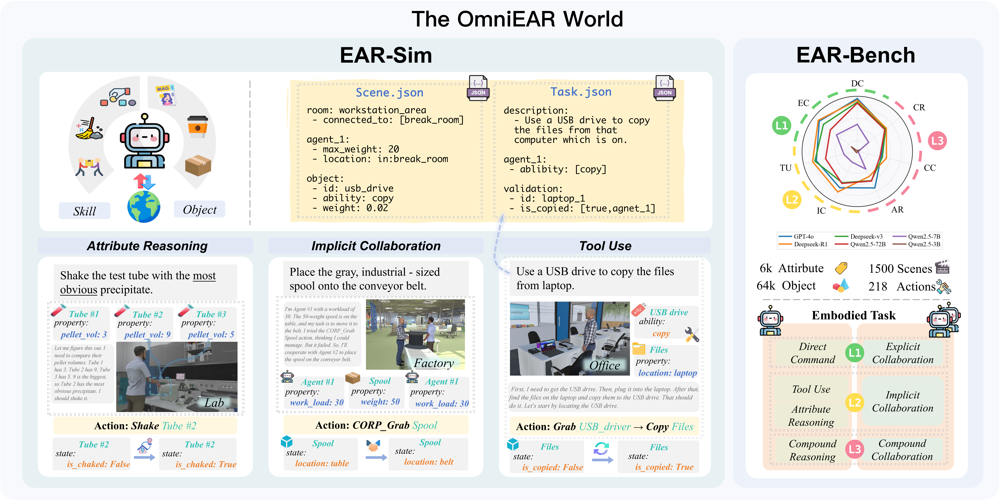

# OmniEAR: Benchmarking Agent Reasoning in Embodied Tasks

[](https://github.com/ZJU-REAL/OmniEmbodied)
[](https://omniembodied.readthedocs.io/en/latest/)
[](https://github.com/ZJU-REAL/OmniEmbodied)
[](https://www.python.org/downloads/)
[](https://opensource.org/licenses/MIT)

**Authors:** Zixuan Wang¹*, Dingming Li¹*, Hongxing Li¹, Shuo Chen¹, Yuchen Yan¹, Wenqi Zhang¹, Yongliang Shen¹†, Weiming Lu¹, Jun Xiao¹, Yueting Zhuang¹

¹Zhejiang University  
*Equal contribution, †Corresponding author

---

## Abstract

Large language models excel at abstract reasoning but their capacity for embodied agent reasoning remains largely unexplored. We present **OmniEAR**, a comprehensive framework for evaluating how language models reason about physical interactions, tool usage, and multi-agent coordination in embodied tasks. Unlike existing benchmarks that provide predefined tool sets or explicit collaboration directives, OmniEAR requires agents to dynamically acquire capabilities and autonomously determine coordination strategies based on task demands. Through text-based environment representation, we model continuous physical properties and complex spatial relationships across **1,500 scenarios** spanning household and industrial domains.

Our systematic evaluation reveals severe performance degradation when models must reason from constraints: while achieving **85-96% success** with explicit instructions, performance drops to **56-85%** for tool reasoning and **63-85%** for implicit collaboration, with compound tasks showing **over 50% failure rates**. Surprisingly, complete environmental information degrades coordination performance, indicating models cannot filter task-relevant constraints. Fine-tuning improves single-agent tasks dramatically (0.6% to 76.3%) but yields minimal multi-agent gains (1.5% to 5.5%), exposing fundamental architectural limitations.



*Figure 1: Overview of the OmniEAR framework comprising three integrated components: **OmniSimulator** (left) uses structured text representation to model environments with objects, agents, and spatial relationships; **EAR-Bench** (right) presents our comprehensive evaluation matrix spanning single-agent and multi-agent tasks.*

---

## 🎯 Key Contributions

1. **Novel Evaluation Framework**: We introduce OmniEAR, the first framework to evaluate embodied reasoning through scenarios requiring agents to understand how physical properties determine actions, capabilities, and coordination needs.

2. **Comprehensive Benchmark**: EAR-Bench provides 1,500 scenarios with continuous physical properties and dynamic capabilities, supported by OmniSimulator and an automated generation pipeline.

3. **Fundamental Insights**: We provide empirical evidence that current language models lack core embodied reasoning capabilities, with performance degrading over 60% when moving from explicit instructions to embodied reasoning.

---

## 📊 Benchmark Statistics


*Figure 2: OmniEAR automated benchmark generation and evaluation framework showing the four-stage pipeline and comprehensive statistics.*

### EAR-Bench Composition
- **1,500** diverse scenarios across household and industrial domains
- **64K** objects with detailed physical properties  
- **6K** attribute types including weight, temperature, material composition
- **7** task categories spanning single-agent and multi-agent scenarios

### Task Categories

**Single-Agent Tasks:**
- **Direct Command** (L1): Basic instruction following
- **Attribute Reasoning** (L2): Continuous property comparison and inference  
- **Tool Use** (L2): Dynamic capability acquisition through tool manipulation
- **Compound Reasoning** (L3): Integrated multi-step planning with multiple challenges

**Multi-Agent Tasks:**
- **Explicit Collaboration** (L1): Clear coordination directives
- **Implicit Collaboration** (L2): Autonomous coordination need recognition
- **Compound Collaboration** (L3): Complex multi-agent scenarios requiring tool use and coordination

---

## 🚀 Quick Start

### Installation

```bash
git clone https://github.com/ZJU-REAL/OmniEmbodied.git
cd OmniEmbodied/OmniSimulator
pip install -e .
cd ..
pip install -r requirements.txt
```

### Configuration

Before running experiments, configure your LLM API key in `config/baseline/llm_config.yaml`:

```yaml
api:
  provider: "deepseekv3"  # Choose your provider
  providers:
    deepseekv3:
      api_key: "your-api-key-here"  # Replace with your actual API key
```

### Running Experiments

```bash
# Run basic evaluation
bash scripts/deepseekv3-wo.sh
```

**Note**: For scripts ending with `-wg.sh` (with global observation), you need to:
1. Set the runtime parameter `--global` when running
2. Configure `global_observation: true` in `config/simulator/simulator_config.yaml`

---

## 📈 Main Results


*Figure 3: Performance comparison across all evaluated models showing systematic degradation from explicit instructions to constraint-based reasoning.*

### Key Findings

1. **Performance Degradation**: All models show substantial performance drops when reasoning must emerge from physical constraints rather than explicit instructions.

2. **Scale Effects**: Larger models (GPT-4o, Gemini-2.5-Flash) achieve better performance but still struggle with compound reasoning tasks.

3. **Reasoning Specialization**: Chain-of-thought reasoning models (Deepseek-R1, QwQ-32B) excel at logical planning but fail to ground physical constraints effectively.

4. **Fine-tuning Limitations**: Supervised fine-tuning dramatically improves single-agent performance (0.6% → 76.3%) but shows minimal multi-agent gains (1.5% → 5.5%).


*Figure 4: Detailed performance analysis across task categories and model architectures.*

---

## 🏗️ Framework Architecture

### OmniSimulator
- **Text-based Environment Modeling**: Efficient simulation through graph representation
- **Dynamic Capability System**: Tool-dependent action binding and unbinding
- **Emergent Collaboration**: Physics-constrained multi-agent interactions

### Automated Generation Pipeline
- **Neural-Symbolic Hybrid**: LLM creativity with rule-based validation
- **Physical Consistency**: Automated verification of scenario feasibility
- **Diverse Domains**: Scenarios spanning household, industrial, and specialized environments

### Evaluation Framework
- **Systematic Assessment**: Standardized protocols across all models
- **Multiple Metrics**: Success rate, step efficiency, reasoning quality
- **Statistical Reliability**: Three independent runs with confidence intervals

---

## 📚 Documentation & Resources

**📖 Complete Documentation**: [https://omniembodied.readthedocs.io/](https://omniembodied.readthedocs.io/en/latest/)

Our comprehensive documentation includes:
- 🚀 **[Quick Start Guide](https://omniembodied.readthedocs.io/en/latest/quickstart.html)** - Get running in minutes
- 🏗️ **[Installation Guide](https://omniembodied.readthedocs.io/en/latest/installation.html)** - Detailed setup instructions  
- 🔧 **[Configuration Guide](https://omniembodied.readthedocs.io/en/latest/configuration.html)** - Comprehensive configuration reference
- 📋 **[API Reference](https://omniembodied.readthedocs.io/en/latest/api/index.html)** - Complete API documentation
- 🎓 **[User Guide](https://omniembodied.readthedocs.io/en/latest/user_guide/index.html)** - Detailed usage tutorials

### Core Components
```
OmniEmbodied/
├── OmniSimulator/          # Environment simulation engine
├── evaluation/             # Benchmark evaluation framework
├── data_generation/        # Automated scenario generation
├── modes/                  # Agent implementations
├── llm/                    # LLM integrations
├── config/                 # Configuration management
└── examples/               # Usage examples and tutorials
```

### Configuration Example
```yaml
# Evaluation configuration
evaluation:
  model_name: "gpt-4o"
  task_categories: ["tool_use", "implicit_collaboration"]
  num_scenarios: 100
  max_steps: 50

# Agent configuration  
agent_config:
  agent_class: "modes.single_agent.llm_agent.LLMAgent"
  max_history: 20
  temperature: 0.1

# Environment configuration
simulator_config:
  partial_observability: true
  dynamic_capabilities: true
  physics_constraints: true
```

---

## 🔬 Experimental Analysis

### Ablation Studies


*Figure 5: Ablation study results showing the impact of different framework components.*

### Efficiency Analysis


*Figure 6: Step efficiency analysis across different model scales and task complexities.*

### Parameter Scaling Effects


*Figure 7: Performance scaling with model parameter count across different task categories.*

---

## 📖 Citation

If you use OmniEAR in your research, please cite our paper:

```bibtex
@article{wang2025omniear,
  title={OmniEAR: Benchmarking Agent Reasoning in Embodied Tasks},
  author={Wang, Zixuan and Li, Dingming and Li, Hongxing and Chen, Shuo and Yan, Yuchen and Zhang, Wenqi and Shen, Yongliang and Lu, Weiming and Xiao, Jun and Zhuang, Yueting},
  journal={Preprint. Under review.},
  year={2025},
  note={Citation will be updated upon publication}
}
```

*Note: This work is currently under review. The final citation format will be updated once the paper is published.*

---

## 🤝 Contributing

We welcome contributions to improve OmniEAR! Please see our [Contributing Guidelines](CONTRIBUTING.md) for details on:

- Adding new task categories
- Extending OmniSimulator capabilities  
- Implementing new evaluation metrics
- Contributing new scenarios to EAR-Bench

### Development Setup
```bash
git clone https://github.com/ZJU-REAL/OmniEmbodied.git
cd OmniEmbodied
pip install -e .
pip install -r requirements-dev.txt
pytest tests/
```

---

## 📄 License

This project is licensed under the MIT License - see the [LICENSE](LICENSE) file for details.

## 🆘 Support

- **📖 Documentation**: [Complete documentation and guides](https://omniembodied.readthedocs.io/en/latest/)
- **🐛 GitHub Issues**: [Report bugs and feature requests](https://github.com/ZJU-REAL/OmniEmbodied/issues)
- **💬 Discussions**: [Join community discussions](https://github.com/ZJU-REAL/OmniEmbodied/discussions)
- **📧 Email**: wang.zixuan@zju.edu.cn, syl@zju.edu.cn

---

## 🌟 Acknowledgments

OmniEAR builds upon foundational research in embodied AI, multi-agent systems, and language model evaluation. We thank the research community for their contributions to understanding the challenges of embodied intelligence. Special thanks to the anonymous reviewers for their valuable feedback in improving this work.
